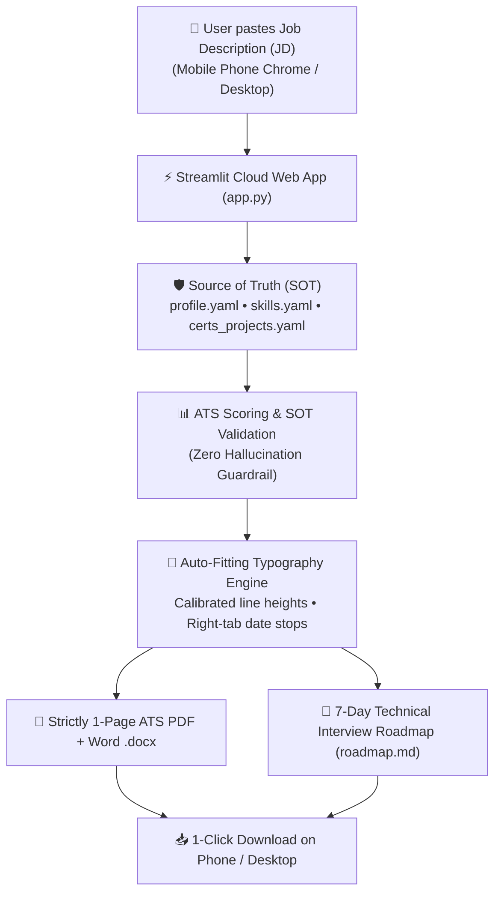

# 🚀 Resume Tailor — Universal Setup & Cloud Deployment Guide

This guide allows **any person** on **any system (Windows, macOS, Linux)** to replicate and deploy their own automated, 24/7 ATS Resume Tailoring and Interview Roadmap platform for **100% Free**.

---

## 📋 System Architecture Overview



---

## ⚡ Quick Start (Automated Setup)

### Step 1: Clone this Repository
```bash
git clone <your-github-repo-url>
cd JD_cust_hrushi
```

### Step 2: Install Python Dependencies
Ensure Python 3.10+ is installed, then run:
```bash
pip install -r requirements.txt
```

### Step 3: Run the Candidate Setup Wizard
Run the interactive wizard to automatically seed your personal profile, contact information, employer history, and reset the application tracker:
```bash
python scripts/setup_new_user.py
```
*(Enter your name, email, phone, LinkedIn, current company, designation, and target role when prompted).*

---

## 🛠️ Step 4: Customize Your Source of Truth (SOT)

Your resume will **never invent false claims or hallucinate skills**. It strictly pulls from these 3 YAML files in `source_of_truth/`:

| File | What to Put Inside |
| :--- | :--- |
| `source_of_truth/profile.yaml` | Your contact details, LinkedIn, companies, and roles. *(Seeded by the setup wizard)* |
| `source_of_truth/skills.yaml` | Your verified technical skills, programming languages, databases, cloud platforms, and tools. |
| `source_of_truth/certs_projects.yaml` | Your real certifications (with Verification IDs & dates) and real production / academic projects. |
| `source_of_truth/bullets_bank.yaml` | Pre-approved STAR-format metric bullets (Situation, Task, Action, Result). |

---

## 🧪 Step 5: Test the Pipeline Locally

Run the automated integration test to verify document rendering, ATS validation, and page-count guardrails:
```bash
python scripts/test_pipeline.py
```
Expected output:
```text
>>> Starting Full Pipeline Test with Dummy JD...
  [x] Saved jd.md
  [x] Rendering resume.docx and resume.pdf...
Generated PDF: ... (Pages: 1)
  [x] Running validator...
  [x] Validator passed successfully!
  [x] Saved report.md
>>> Test Pipeline Complete! All components verified.
```

---

## 🌐 Step 6: Deploy to the Cloud (100% Free Forever, 24/7 Mobile Access)

You can run this app without keeping your laptop on. It runs 24/7 on **Streamlit Community Cloud** (backed by Snowflake) for **₹0 / $0** with **zero credit card required**.

### 1. Push to your GitHub Account
```bash
git add .
git commit -m "feat: Configure Resume Tailor for my profile"
git remote set-url origin https://github.com/<YOUR_GITHUB_USERNAME>/<YOUR_REPO_NAME>
git push -u origin main
```

### 2. Deploy on Streamlit Cloud (2 Minutes)
1. Open **[share.streamlit.io](https://share.streamlit.io)** in your browser.
2. Click **"Continue with GitHub"** and authorize your GitHub account.
3. Click **"Create app"**:
   - **Repository:** `<YOUR_GITHUB_USERNAME>/<YOUR_REPO_NAME>`
   - **Branch:** `main`
   - **Main file path:** `app.py`
   - **App URL:** (Choose your custom name, e.g. `yourname-resume.streamlit.app`)
4. Click **Deploy!**

In ~90 seconds, you will receive a permanent live URL!

---

## 📱 How to Use on Your Smartphone (30-Second Application Flow)

1. Open your custom URL (e.g. `https://yourname-resume.streamlit.app`) in **Chrome** or **Safari** on your phone.
2. Tap the browser menu $\rightarrow$ **"Add to Home Screen"** to get a 1-tap mobile app icon.
3. When you find a job opening on **Naukri, LinkedIn, or Indeed**:
   - Copy the Job Description (JD).
   - Paste it into your Resume Tailor app and tap **"🚀 Tailor Resume & Roadmap"**.
   - Tap **"📥 Download 1-Page PDF Resume"** (saves directly into your phone's Downloads folder).
   - Read your **7-Day Technical Interview Roadmap** and top interview questions on your screen.
   - Switch back to Naukri / LinkedIn and upload the downloaded PDF to apply immediately!

---

## 🛡️ Guarantees Built Into the Platform
1. **Strictly 1-Page Guarantee:** The auto-calibrating typography engine dynamically measures PDF page height and switches between `spacious` and `compact` font sizes/line heights to guarantee the resume never spills onto page 2.
2. **Deterministic Anti-Hallucination:** Guardrails cross-check all keywords against `source_of_truth/` to prevent AI exaggeration.
3. **Cross-Platform Cloud Conversion:** Uses Microsoft Word COM automation on Windows and headless `libreoffice` on Linux cloud runners (`packages.txt`).
