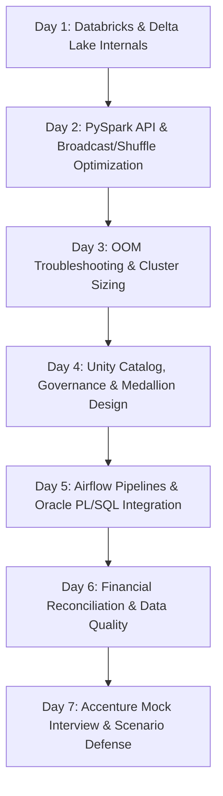

# 🎯 7-Day Technical Interview Roadmap: Data Engineer (Databricks) at Accenture

- **Target Company:** Accenture
- **Role:** Data Engineer (Databricks & Cloud ETL)
- **Primary Tech Stack:** Databricks, PySpark, PL/SQL, Apache Airflow, AWS S3, Delta Lake, Snowflake
- **Created On:** 2026-09-29

---

## 📌 Executive Summary & Interview Strategy
Accenture's technical interviews for Databricks Data Engineers focus heavily on:
1. **Cloud & Lakehouse Architecture:** Deep Databricks platform knowledge, Unity Catalog, Delta Lake ACID properties, and Medallion architecture.
2. **PySpark & Performance Optimization:** Cluster configuration, shuffle tuning, broadcast joins, handling skewed datasets, and debugging OOM errors.
3. **Enterprise Data Pipelines & Orchestration:** Airflow DAG scheduling, SLA adherence, and PL/SQL / Oracle database integration.

---

## 📅 Day-by-Day 7-Day Preparation Plan

---

### Day 1: Databricks & Delta Lake Architecture
* **Key Topics:**
  * Delta Lake ACID Transaction Log (`_delta_log` JSON protocol, checkpoint files).
  * Time Travel & Versioning: `RESTORE TABLE`, `AS OF VERSION`.
  * Performance: `OPTIMIZE table ZORDER BY (col)`, Auto-Compaction, and `VACUUM`.
  * Medallion Pipeline Design: Bronze (Raw ingestion) $\rightarrow$ Silver (Cleaned / Cleansed) $\rightarrow$ Gold (Aggregated Business Marts).

### Day 2: PySpark Transformations & Distributed Processing
* **Key Topics:**
  * Vectorized PySpark DataFrame operations vs. slow Python loops / UDFs.
  * Narrow vs. Wide dependencies; stages and task distribution.
  * Partitioning strategies: `repartition()` vs. `coalesce()`.
  * Broadcast Hash Join threshold tuning (`spark.sql.autoBroadcastJoinThreshold`).

### Day 3: Performance Tuning, OOM Debugging & Cluster Sizing
* **Key Topics:**
  * Identifying data skew in the Spark UI (Event timeline, task duration outliers).
  * Key Salting techniques for heavily skewed joins.
  * Cluster sizing tradeoffs: Single-node vs. Multi-node; Driver vs. Worker memory allocation.
  * The State Bank of India story: Reducing pipeline downtime by 30% via shuffle and OOM tuning.

### Day 4: Data Governance & Unity Catalog
* **Key Topics:**
  * 3-level namespace: `catalog.schema.table_or_view`.
  * Data lineage, access control, and auditing.
  * Structured Streaming basics & Auto Loader (`cloudFiles`).

### Day 5: Apache Airflow & Database Integration
* **Key Topics:**
  * Airflow DAG design with `DatabricksSubmitRunOperator` or `DatabricksRunNowOperator`.
  * Oracle DB / PL/SQL data extraction patterns, indexing, and batch loading.
  * SLA monitoring and failure alerting mechanisms (sustaining 99.8% SLA).

### Day 6: Data Quality & Ledger Reconciliation
* **Key Topics:**
  * Automated pre-load and post-load reconciliation frameworks.
  * Verifying debit/credit ledger balance consistency across 12-hour settlement batches.
  * Schema consistency and audit compliance assertions (25% accuracy gain).

### Day 7: Accenture Mock Interview & STAR Scenarios
* **Key Topics:**
  * Rehearse answering: *"Why Databricks over traditional Spark on EMR or Hadoop?"*
  * Rehearse answering: *"Walk me through an incident where an Airflow pipeline failed in production."*
  * Defense of certifications: Demonstrating deep Databricks Certified Associate and AWS Solutions Architect mastery.
