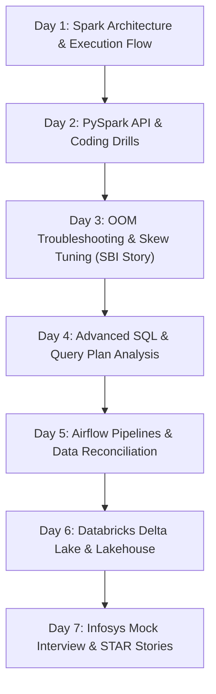

# 🎯 7-Day Technical Interview Roadmap: PySpark Data Engineer at Infosys

- **Target Company:** Infosys
- **Role:** PySpark Data Engineer (2 - 5 Years Experience)
- **Work Mode & Locations:** Hybrid (Pune, Hyderabad, Bengaluru)
- **Primary Tech Stack:** PySpark, Apache Spark, Spark SQL, Python, Apache Airflow, Databricks, Oracle / Snowflake
- **Created On:** 2026-09-29

---

## 📌 Executive Summary & Interview Strategy
Infosys technical interviews for Data Engineering (2–5 years) typically consist of **two technical rounds** followed by a managerial/HR discussion:
1. **Round 1 (Core Coding & PySpark Fundamentals):** Live PySpark DataFrame coding, transformations vs. actions, handling nulls/aggregations, and core Python questions.
2. **Round 2 (Architecture, Troubleshooting & Performance Tuning):** Deep dive into the Spark UI, shuffle optimization, resolving Out-Of-Memory (OOM) errors, data skew mitigation, Airflow DAG reliability, and SQL window functions.
3. **Round 3 (Managerial & Project Walkthrough):** Deep dive into your State Bank of India (SBI) banking project, SLA management, and team collaboration.

---

## 📅 Day-by-Day 7-Day Preparation Plan

---

### Day 1: Spark Core & Execution Architecture
* **Goal:** Master explaining Spark internals without hesitation.
* **Topics to Review:**
  * **Cluster Anatomy:** Driver vs. Cluster Manager (YARN, Standalone, K8s) vs. Worker Nodes vs. Executors.
  * **Execution Hierarchy:** Application $\rightarrow$ Job (triggered by Action) $\rightarrow$ Stages (split by Wide Transformations/Shuffles) $\rightarrow$ Tasks (executed on Executor Cores/Slots).
  * **Catalyst Optimizer:** Unresolved Logical Plan $\rightarrow$ Resolved Logical Plan $\rightarrow$ Optimized Logical Plan (Constant folding, Predicate Pushdown, Projection Pruning) $\rightarrow$ Physical Plan $\rightarrow$ Code Generation (Tungsten).
* **Self-Check Question:** *"What happens under the hood when I run `df.groupBy("dept").count().show()`?"*
* **Reference Docs:** [Apache Spark Architecture Overview](https://spark.apache.org/docs/latest/cluster-overview.html)

---

### Day 2: PySpark DataFrame API & Live Coding
* **Goal:** Write clean, vectorized PySpark code without falling back to slow Python loops.
* **Topics to Practice:**
  * Avoid Python UDFs (they cause JVM-Python serialization overhead); use `pyspark.sql.functions` instead (`when`, `otherwise`, `col`, `expr`).
  * Aggregations & Pivot tables: `groupBy()`, `agg(sum(), avg())`, `pivot()`.
  * Array & Struct manipulation: `explode()`, `col().getItem()`, `struct()`.
  * Repartition vs. Coalesce:
    * `repartition(n)`: Wide transformation (triggers full shuffle, increases or decreases partitions evenly).
    * `coalesce(n)`: Narrow transformation (no shuffle, decreases partitions only).
* **Coding Exercise:** Given a JSON schema with nested client transactions, write PySpark code to flatten the schema, drop null transaction IDs, deduplicate by timestamp, and compute 7-day rolling revenue.

---

### Day 3: Performance Tuning & OOM Debugging (Your Core SBI Advantage!)
* **Goal:** Be ready to walk through your real-world 30% downtime reduction story.
* **Topics to Review:**
  * **Memory Structure:** Unified Memory Manager (Execution Memory for shuffles/joins, Storage Memory for caching/broadcast, User Memory, Reserved Memory).
  * **Common OOM Causes:**
    * *Driver OOM:* Calling `.collect()` or `.toPandas()` on large datasets. Fix: Use `.take(n)` or aggregate before collecting.
    * *Executor OOM:* Data skew where one partition has 80% of data; broadcast table too large; memory spill to disk.
  * **Data Skew Solutions:**
    1. **Broadcast Hash Join (`broadcast(df)`):** When one table is $< 10$ MB (tunable up to 100MB+ in memory).
    2. **Key Salting:** Adding a random integer suffix (`key_0` to `key_n`) to distribute hot keys across multiple partitions.
    3. **AQE (Adaptive Query Execution):** Spark 3.x features (`spark.sql.adaptive.enabled=true`, `skewJoin.enabled=true`).
  * **Shuffle Tuning:** Tuning `spark.sql.shuffle.partitions` (default 200). Formula: `Total Data Size / 128 MB`.

---

### Day 4: Advanced SQL & Query Plan Analysis
* **Goal:** Solve complex analytical queries with zero syntax errors.
* **Topics to Review:**
  * **Window Functions:**
    * `ROW_NUMBER()`, `RANK()`, `DENSE_RANK()` (understand difference when values are identical).
    * `LEAD()` and `LAG()` for comparing current vs. previous transaction timestamps.
    * Cumulative running sum: `SUM(amount) OVER (PARTITION BY account_id ORDER BY trans_date ROWS BETWEEN UNBOUNDED PRECEDING AND CURRENT ROW)`.
  * **Common Table Expressions (CTEs):** Writing modular, readable multi-stage SQL models.
  * **Query Plan:** Running `EXPLAIN EXTENDED` and identifying Table Scans vs. Index Seeks, Sort Merge Joins vs. Hash Joins.

---

### Day 5: Apache Airflow & Data Quality Frameworks
* **Goal:** Demonstrate enterprise pipeline reliability and 99.8% SLA maintenance.
* **Topics to Review:**
  * **Airflow Core Concepts:** DAGs, Operators (`PythonOperator`, `BashOperator`, `SparkSubmitOperator`), Sensors, Hooks, XComs.
  * **Pipeline Idempotency:** Ensuring re-running a failed DAG for a historical date does not duplicate records (truncate & reload staging, partition overwrite).
  * **Failure Alerting & Retries:** `retries=3`, `retry_delay=timedelta(minutes=5)`, `on_failure_callback` triggering Slack/Email alerts.
  * **Financial Reconciliation:** Explain your SBI reconciliation logic (validating record counts and checking `SUM(debits) == SUM(credits)` before promoting to production datamarts).

---

### Day 6: Databricks & Cloud Lakehouse (Your Certified Advantage!)
* **Goal:** Leverage your **Databricks** and **Microsoft Fabric** credentials to stand out.
* **Topics to Review:**
  * **Delta Lake Architecture:** ACID compliance on top of Parquet, `_delta_log` JSON commit logs.
  * **Time Travel:** Querying historical versions (`SELECT * FROM table VERSION AS OF 3`).
  * **Optimization Commands:**
    * `OPTIMIZE table_name ZORDER BY (col1, col2)` (clustering co-located columns to skip data files).
    * `VACUUM table_name RETAIN 168 HOURS` (purging deleted historical files).
  * **Medallion Architecture:** Bronze (Raw append-only landing) $\rightarrow$ Silver (Cleaned, validated, normalized tables) $\rightarrow$ Gold (Aggregated dimensional business marts).

---

### Day 7: Infosys Mock Interview & STAR Project Storytelling
* **Goal:** Deliver confident, structured answers with numbers.
* **STAR Story 1 (OOM & Performance Tuning):**
  * *Situation:* State Bank of India's daily 12-hour settlement cycle was experiencing pipeline failures and timeouts during peak batch hours.
  * *Task:* Identify the root cause and ensure pipelines finished within the strict SLA window.
  * *Action:* Analyzed the Spark UI Event Timeline and identified severe executor data skew in settlement join keys. Implemented broadcast joins for lookup tables and applied shuffle partition tuning.
  * *Result:* Eliminated recurring OOM crashes, cutting pipeline downtime by 30% and saving 20% on batch execution runtime.
* **STAR Story 2 (Financial Reconciliation & Data Quality):**
  * *Situation:* Audit requirements mandated zero discrepancy between source core banking tables and downstream analytics datamarts.
  * *Task:* Automate validation checks to prevent incomplete batches from polluting business reports.
  * *Action:* Developed pre-load and post-load reconciliation scripts in SQL and PySpark cross-verifying transaction totals and primary key integrity.
  * *Result:* Improved audit compliance data accuracy by 25% with 99.8% SLA reliability.

---

## 💡 Top 10 Infosys PySpark Interview Questions to Rehearse

1. **What is the difference between RDD, DataFrame, and Dataset? Why use DataFrames in PySpark?**
   * *Answer Key:* RDD is low-level and lacks query optimization. DataFrame is a distributed collection of Row objects organized into named columns, optimized by Catalyst Optimizer and Tungsten code generation. Datasets are typed (Scala/Java only).
2. **What is the difference between `groupByKey()` and `reduceByKey()`?**
   * *Answer Key:* `groupByKey()` transfers all values across the network (massive shuffle), leading to OOM. `reduceByKey()` performs map-side local combination before shuffling, minimizing network I/O.
3. **What is Data Skew and how have you solved it in production?**
   * *Answer Key:* One partition receives disproportionately more records than others, causing 1 task to run forever while others finish. Solved using Broadcast joins or Salting keys.
4. **Explain Broadcast Join threshold.**
   * *Answer Key:* `spark.sql.autoBroadcastJoinThreshold` (default 10MB). When a table is smaller than this threshold, Spark broadcasts it to all executor memory, completely avoiding a shuffle.
5. **How do you debug an OOM error in PySpark?**
   * *Answer Key:* Inspect the Spark UI $\rightarrow$ check if failure occurred during Shuffle Read/Write or GC pauses $\rightarrow$ increase `spark.sql.shuffle.partitions` or repartition before the join $\rightarrow$ check if `.collect()` was improperly used on the driver.
6. **What is the difference between Narrow and Wide transformations?**
   * *Answer Key:* Narrow: each partition of parent RDD is used by at most 1 partition of child RDD (`map()`, `filter()`). Wide: multiple child partitions depend on data from parent partitions, requiring a shuffle (`groupBy()`, `join()`, `distinct()`).
7. **How does Delta Lake ensure ACID transactions?**
   * *Answer Key:* Using an append-only JSON transaction log (`_delta_log`) and mutual exclusion. Changes are written as new Parquet files, and commits are atomic.
8. **What is Lazy Evaluation in Spark?**
   * *Answer Key:* Spark does not execute transformations immediately. It builds a DAG (Directed Acyclic Graph) of operations and only executes when an action (e.g., `count()`, `show()`, `write()`) is called, enabling the Catalyst optimizer to optimize the execution plan.
9. **Explain Window Functions in SQL vs. PySpark.**
   * *Answer Key:* Both allow computing metrics across a group of rows without collapsing rows (unlike `GROUP BY`). In PySpark, defined using `Window.partitionBy().orderBy()`.
10. **How do you handle schema drift in PySpark?**
    * *Answer Key:* Use schema validation checks, `.option("mergeSchema", "true")` when reading Parquet/Delta, or enforce explicit `StructType` schemas on ingestion.
